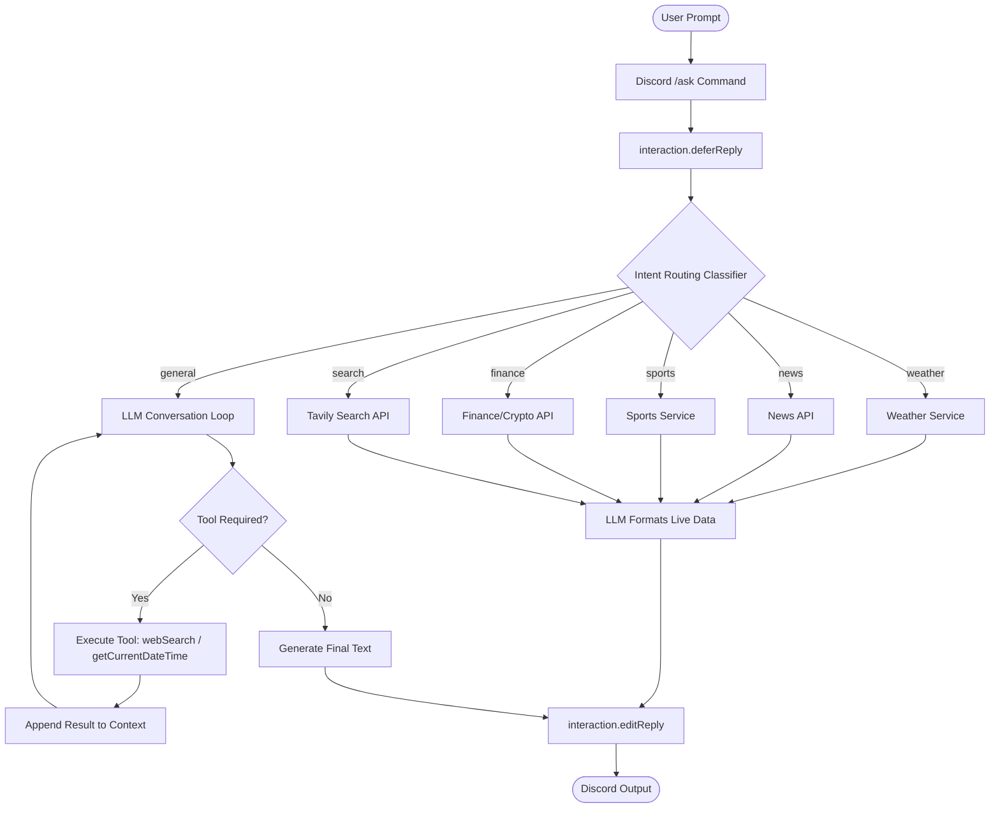

# 🤖 Discord AI Agent

An advanced, production-ready **AI-Powered Discord Agent** built with **Node.js** and **Discord.js (v14)**. The agent is powered by **Google Gemini** and **Groq (Llama 3.1)** APIs, utilizing an **Intelligent Query Router** and **Native Tool/Function Calling** to retrieve live data, execute multi-step reasoning, and maintain persistent conversation state using **MongoDB**.

Unlike a traditional static chatbot, this agent analyzes user intent, calls external APIs (such as Tavily search, weather, news, sports, and finance services), manages personal conversational memory, and automates server moderation and support ticketing panels.

---

## 🚀 Features

*   **Intelligent Conversations (`/ask`):** Engaging, natural-language dialogues with the AI.
*   **Dual AI Engine Support:** Supports both Google Gemini (default) and Groq (Llama 3.1) endpoints with fast auto-fallback.
*   **Dynamic Intent Routing:** An intelligent classifier parses query topics and routes them to dedicated real-time APIs (Weather, Finance, Sports, News) before formatting responses.
*   **Autonomous Tool/Function Calling:** The LLM autonomously triggers server tools (`getCurrentDateTime`, `webSearch`) for general queries when it needs real-time context.
*   **Live Web Search (`/search`):** Search integration powered by **Tavily API**, allowing the agent to synthesize search results with full citations.
*   **Persistent Memory (`/reset` / `/history`):** User conversation history is stored securely in **MongoDB Atlas**, enabling consistent context retention across server restarts.
*   **Automated Ticketing (`/setup-tickets`):** Button-based support ticketing panel creating private, staff-managed support channels.
*   **Audit Logging (`/setup-logs`):** Auto-logging of deleted messages, updated messages, and member joins/departures to designated staff channels.
*   **Leveling System (`/rank` / `/leaderboard`):** Chat XP leveling system with anti-spam cooldowns.
*   **Study Suite (`/notes`, `/quiz`, `/explain`, `/interview`):** Interactive study tools, including customizable mock interviews with live step-by-step evaluations.

---

## 🧠 How the AI Agent Works

The agent processes requests using a combination of **Intent Routing** and **LLM Tool Calling**:



---

## 🔧 AI Agent Capabilities

A traditional AI chatbot simply parses text and generates static answers from static training weights. 

This project implements **Agentic Capabilities** by allowing the model to:
1.  **Deconstruct goals** into sub-tasks (e.g. searching the web, analyzing multiple sources, and summarizing).
2.  **Use External APIs** (Tavily, OpenWeatherMap, CoinGecko, NewsAPI) to pull ground-truth data instead of hallucinating.
3.  **Execute loops with safety caps** (limited to a maximum of 3 consecutive tool calls to prevent infinite loops).
4.  **Gracefully fail-fast** under rate limits or timeouts, notifying the user rather than leaving them stuck on a "thinking" indicator indefinitely.

---

## 🌐 Live Web Search

When a query requires real-time information, the agent calls the **Tavily API**:
*   The agent extracts search terms and performs an optimized web crawl.
*   Tavily returns filtered, LLM-friendly snippets and URLs.
*   The agent analyzes the results, synthesizes a cohesive response, and generates citations (e.g. `[Title](Link)`).
*   If Tavily fails or times out, the tool loop catches the exception and returns the error safely to the agent to summarize without crashing the Discord process.

---

## 💾 Memory & Knowledge Persistence

The Discord AI Agent operates a dual-layer memory system to maintain rich, long-term state across sessions while retaining immediate conversational flow.

```
                  ┌──────────────────────────────────────────┐
                  │            Discord User Input            │
                  └────────────────────┬─────────────────────┘
                                       │
                    ┌──────────────────┴──────────────────┐
                    ▼                                     ▼
        ┌───────────────────────┐             ┌───────────────────────┐
        │   Short-Term Memory   │             │   Long-Term Memory    │
        │  (Session history)    │             │   (Persistent Facts)  │
        ├───────────────────────┤             ├───────────────────────┤
        │ Last 20 messages      │             │ Categorized User facts│
        │ stored as a window    │             │ loaded on-demand via  │
        │ in MongoDB doc store. │             │ autonomous LLM tools. │
        └───────────────────────┘             └───────────────────────┘
```

### 1. Short-Term Memory vs Long-Term Memory
*   **Short-Term Memory (Conversational History)**: Dynamically fetches and rolls the last 20 messages (10 turn-rounds) from the MongoDB general key-value store to maintain active dialog context.
*   **Long-Term Memory (Agent Memory Tool)**: Exposes structured key-value database operations directly to the LLM. The agent autonomously writes, updates, queries, and wipes memories based on user preferences, profile details, projects, and custom instructions.

### 2. Long-Term Memory MongoDB Schema
Stored inside the `memories` collection with strict user isolation indexes:
```javascript
{
  userId: { type: String, required: true },
  guildId: { type: String, default: null },
  key: { type: String, required: true }, // Compound unique index: { userId, key }
  value: { type: Schema.Types.Mixed, required: true },
  category: { 
    type: String, 
    enum: ['preference', 'profile', 'project', 'goal', 'instruction', 'context', 'other'],
    default: 'other' 
  },
  importance: { type: Number, min: 1, max: 10, default: 5 },
  source: { type: String, default: 'conversation' },
  lastAccessedAt: { type: Date, default: Date.now }
}
```

### 3. Exposed LLM Memory Tools
Both Gemini and Groq reasoning engines possess these custom tool specifications:
*   `save_memory(key, value, category, importance)`: Saves a new fact about the user.
*   `search_memory(query)`: Autonomously queries key and value fields using regex index matching.
*   `update_memory(key, value)`: Modifies existing values without duplicating keys.
*   `delete_memory(key)`: Deletes individual keys or wips user memories entirely when `key = "everything"`.

### 4. Example Interaction Workflow
1.  **User**: *"I prefer Python now instead of Java."*
2.  **Agent Action**: Detects context change, runs tool `update_memory(key="favorite_language", value="Python")`.
3.  **User**: *"What project should I build?"*
4.  **Agent Action**: Decides to query profile context, runs tool `search_memory(query="programming language preference")` -> returns `"Python"`.
5.  **Agent Response**: *"Since you prefer Python, I suggest building a web scraper using FastAPI or a Discord bot using Discord.py..."*

### 5. Running the Memory Test Suite
You can validate the database schemas, upsert operations, duplicate prevention, and user isolation scopes by running:
```bash
node test_memory.js
```

---

## 🛠️ Tech Stack

| Technology | Purpose |
|---|---|
| **Node.js** | Runtime Environment |
| **Discord.js (v14)** | Discord Gateway & Slash Command Integration |
| **Google Gemini API** | Primary LLM Reasoning & Classification |
| **Groq API** | High-speed Llama-3.1-based Secondary LLM |
| **Tavily API** | AI-Optimized Live Web Search |
| **MongoDB Atlas** | Database for Memory & Config Persistence |
| **Express & Socket.IO** | Backend REST & WebSocket Server (port 3001) |
| **React & Vite** | Frontend Dashboard (port 5173) |

---

## 📂 Project Structure

```
├── commands/               # Discord Slash Command Modules
│   ├── ask.js              # State-aware AI question handler
│   ├── clear-memory.js     # Wipe stored conversation database entry
│   ├── code.js             # Code generation and explainer suites
│   ├── generate-image.js   # Imagen-based image generation engine
│   ├── history.js          # View user's active context memory
│   ├── interview.js        # Practice mock interviews with evaluations
│   ├── moderation.js       # Administrative ban/kick/timeout tools
│   ├── setup-logs.js       # Configure server audit log channel
│   ├── setup-tickets.js    # Configure support ticket panels
│   └── translate.js        # Text translation helper
├── config/
│   └── config.json         # Discord embed layout styles
├── events/                 # Discord Server Event Handlers
│   ├── interactionCreate.js # Slash command & button coordinator
│   ├── guildMemberAdd.js   # Welcome messages & Member join logger
│   └── messageDelete.js    # Deleted message logger
├── services/               # Core Integration APIs & Middleware
│   ├── ai.js               # Gemini & Groq REST APIs + Tool Calling Loop
│   ├── database.js         # Mongoose Schemas & Mongo Connection Wrapper
│   ├── router.js           # Classification Intent Router
│   ├── search.js           # Tavily Web Crawl API
│   ├── server.js           # REST API & Socket.IO admin backend
│   └── time.js             # Server-time utilities
├── dashboard/              # React/Vite Admin Dashboard
├── deploy-commands.js      # Discord Slash Command deployment script
├── index.js                # Main Bot entry point
└── package.json            # Script dependencies
```

---

## ⚙️ Installation & Setup

### 1. Prerequisites
*   Node.js (v18.0.0 or higher)
*   MongoDB Instance (Atlas recommended)

### 2. Installation
Clone the repository and install the dependencies:
```bash
git clone https://github.com/tejas2504-p/AI-Discord-Bot.git
cd AI-Discord-Bot
npm install
```

### 3. Environment Configuration
Create a `.env` file in the root directory:
```env
DISCORD_TOKEN=your_discord_bot_token
CLIENT_ID=your_discord_client_id
GUILD_ID=your_testing_server_id (optional)
GEMINI_API_KEY=your_google_studio_api_key
GROQ_API_KEY=your_groq_developer_api_key (optional, switches AI to Llama)
TAVILY_API_KEY=your_tavily_search_api_key
MONGO_URI=mongodb+srv://... (or local mongodb URI)
```

> [!NOTE]
> If your MongoDB password contains special characters, make sure you URL-encode them (e.g. `@` as `%40`) in `MONGO_URI`.

### 4. Deployment & Execution
Register slash commands with Discord:
```bash
node deploy-commands.js
```

Start the Discord Bot and API Backend server:
```bash
node index.js
```

Start the Admin web dashboard (in a separate terminal):
```bash
cd dashboard
npm install
npm run dev
```

---

## 📊 AI Bot vs AI Agent

| AI Bot | AI Agent |
|---|---|
| Generates responses from static weights | Queries live, current internet databases |
| Follows single-turn templates | Loops reasoning steps to find answers |
| Lacks context of external tools | Autonomously calls weather/sports/finance/search tools |
| Reactive to direct inputs | Capable of intent classification and routing |

---

## 🔮 Future Improvements

-   **Autonomous RAG (Retrieval-Augmented Generation):** Custom PDF/doc indexing for localized server knowledge.
-   **Advanced Vector Databases:** Integration with Pinecone/Milvus for long-term semantic user memory.
-   **Multi-Agent Coordination:** Spawning separate agents specialized in coding, moderation, and support.
-   **Scheduled Cron Tasks:** Autonomous scheduled alerts (e.g., daily market updates) posted directly to servers.

---

## 👨‍💻 Developer

*   **GitHub:** [@tejas2504-p](https://github.com/tejas2504-p)
*   **Project Repository:** [AI-Discord-Bot](https://github.com/tejas2504-p/AI-Discord-Bot)

---

## 📜 License

This project is licensed under the **ISC License**.
